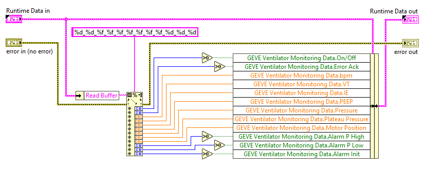

# Arduino to LabVIEW Communication

For this project, the [Arduino Code](../../../Arduino-Code) does the heavy lifting by interacting with the physical control knobs and executing the main ventilator functionality.
However, we wanted to add the option for **monitoring** and **graphing** the process variables of the ventilator **over time**.
For this purpose, we decided to send the most important run-time variable values from the Arduino as a formatted String and then reading and graphing them in LabVIEW.

## Communication Options

Aside from sending the data as raw bytes, there are libraries available to send data serialized as JSON, XML, MessagePack and other formats but we decided here to go for a simple formatted string that can be sent without including any libraries and easily parsed on the LabVIEW side.

* **Raw Bytes:** Fast and small but you need to handle low-level parsing, non-printable characters, and splitting and joining on both sides.
* **Formatted String:** Reasonably fast (4 ms to send all values). Easy to read - by humans and machines. No libraries required. Not necessarily a standard format.
* **JSON et al.:** A standard. But serialization of all values took 74 ms.

In the end we went for sending a fixed string in the format `<number>_<number>_ ... _<number>\r\n` in each Arduino loop iteration.

Feel free to improve! :-)

## Preparing the Data

On the Arduino side, we declare a struct type to store our process values during execution:  
(All places in the Arduino code dealing with the PC Interface are commented with `PCIF` to find them easily.)

```
// PCIF------ Type declaration of runtime data for GEVE Ventilator Monitoring ---------- //
struct GEVE_VeMon_Data
{
  bool on_off;               // On/Off status of the control program
  bool error_ack;            // User has pressed the acknowledge error button 
  double breath_pm;          // Breaths per minute potentiometer setting
  double tidal_volume;       // Tidal volume potentiometer setting
  double in_ex_ratio;        // Inhale-to-exhale ratio potentiometer setting
  double peep;               // Positive End-Expiratory pressure potentiometer setting
  double pressure;           // Pressure value measured by pressure sensor
  double pressure_plateau;   // Pressure plateau setting 
  double motor_position;     // Motor position reported from the motor controller
  bool alarm_p_high;         // Alarm status for pressure too high
  bool alarm_p_low;          // Alarm status for pressure too low
  bool alarm_init;           // Alarm status for initialization failed
};
```

We then define a variable of our struct type and initialize its members with default values:

```
// PCIF------ Variable definition of type GEVE runtime data for communication ---------- //
GEVE_VeMon_Data geve_status =
{
  false,
  false,
  0.0,
  0.0,
  0.0,
  0.0,
  0.0,
  0.0,
  0.0,
  false,
  false,
  false
};
``` 

In the Arduino main loop code, the variable members are set at appropriate places:  
(Here, as an example, the BPM value setting is shown):

```
bpm = analogRead(PIN_BPM_IN) * DELTA_BPM / 1024 + MIN_BPM;
[...]
geve_status.breath_pm    = bpm; // <--- PCIF ---
```

All other values are updated at other places throughout the code.

Finally, at the end of the Arduino main loop, we send all the data out via the serial interface:  
**Note:** This requires to **disable** (comment-out) **all other serial debug output**. This could easily be avoided by using for example the [_SoftwareSerial_](https://www.arduino.cc/en/Reference/SoftwareSerial) library on other digital outputs if available. During testing we saw that this takes about 54 ms to send the values instead of 4 ms with the normal USB UART.  
You could also define a special string token for LabVIEW to listen for. Be creative (and document it ;-)).

```
  //
  // PCIF------ Communicate status to PC interface ---------- //
  Serial.print(geve_status.on_off);
  Serial.print("_");
  Serial.print(geve_status.error_ack);
  Serial.print("_");
  Serial.print(geve_status.breath_pm);
  Serial.print("_");
  Serial.print(geve_status.tidal_volume);
  Serial.print("_");
  Serial.print(geve_status.in_ex_ratio);
  Serial.print("_");
  Serial.print(geve_status.peep);
  Serial.print("_");
  Serial.print(geve_status.pressure);
  Serial.print("_");
  Serial.print(geve_status.pressure_plateau);
  Serial.print("_");
  Serial.print(geve_status.motor_position);
  Serial.print("_");
  Serial.print(geve_status.alarm_p_high);
  Serial.print("_");
  Serial.print(geve_status.alarm_p_low);
  Serial.print("_");
  Serial.print(geve_status.alarm_init);

  Serial.println();
  //
```

The resulting string should then look something like this:

```
1_0_133.00_296.00_4.93_188.84_108.74_772.82_122.50_0_0_0\r\n
```

## Receiving the Data (in LabVIEW)

Now that we know what the process data structure looks like, we'll have a look at how to 'decode' the string on the LabVIEW side.

First, we recreate our type declaration in LabVIEW by making a cluster type definition that looks exactly like the struct we defined in the Arduino code:


The key elements of the LabVIEW program are now to
* configure and open the serial port
* read the data until the `CRLF` termination is received
* parse the data string and
* update the Front Panel indicators.

When **opening the serial port** (a VISA resource in LabVIEW), the default configuration already is set to listen for a LineFeed termination character `LF` (\r or `0x10`) or to wait until a timeout is reached.

 

We then can listen for an expected maximum amount of input data on the serial port.
The **read node** should execute successfully when less than the specified maximum byte count is received, terminated with a LineFeed `LF` character.
Otherwise we'll get an error injected on the error wire that will have to be dealt with in an error handler.

The received data is stored in a _Read Buffer_ to be parsed later.

 

Now that we've received the data from the Arduino, we can parse the string and put all data items into their place within our data cluster.
LabVIEW already provides us with a native **_Scan From String_** programming node.
This receives our previously stored _Read Buffer_ data as an input, as well as a _Format String_, similar to what you'd specify for example in a `printf()` call in _C_.  
In our case, we decided to have the format string look like this: `%d_%d_%f_%f_%f_%f_%f_%f_%f_%d_%d_%d`.
The booleans from the Arduino are interpreted as _Signed decimal integer_ while the doubles are interpreted as _Floating-point number with fractional format (for example, 12.345)_.
If we had mis-typed the format string or if we had received some other garbled String from the Arduino, the _Scan From String_ function would throw an error that would need to be dealt with later on.  
If all goes well, these values can now be bundled into our data cluster for later use.



With the monitoring data stored in our data cluster, we can now **update our Front Panel indicators**. From the same data, we can build our graph to display the value changes over time.


This concludes describing the key items within the _GEVE Monitoring Interface_ LabVIEW program. The "Design Pattern" we went for here is called _Queued Message Handler_ in 'Classic LabVIEW' (i.e without Classes).

Feel free to look at the code and make improvements! :-)

## Other Cool Stuff

If you're interested in learning more, here's a tip of the hat to the folks at the [LabVIEW MakerHub](https://www.labviewmakerhub.com) and their [LabVIEW MakerHub](https://www.labviewmakerhub.com/doku.php?id=libraries:linx:start) which in essence lets you specify the Arduino as a deployment target and write your functionality in LabVIEW. Inspiration was drawn from their _custom command_ concept.  